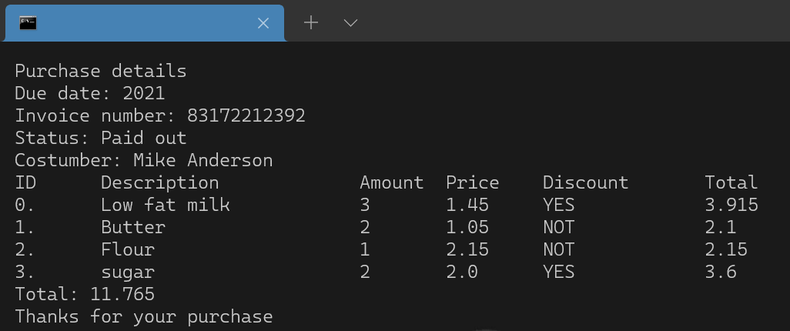

   

Json reader for c++, allows to generate a structure "Json" in c++ from a simple json file.  
build with c++ only, using the fstream and regex libraries.
# Usage
1.	Include JsonReader ``` #include"path/to/JsonReader.h"```
2.	Create a the Json object  ``` Json file("path/to/file.json"); // path to json file ```
3.	Get property like ``` file["path"]["to"]["property"]```  if is array put the number like ``` file["array"][9]["property"]```
    
From the following json file:  
```json
{
    "firstName": "Rack",
    "lastName": "Jackon",
    "gender": "man",
    "age": 24,
    "address": {
        "streetAddress": "126",
        "city": "San Jone",
        "state": "CA",
        "postalCode": "394221"
    },
    "phoneNumbers": [
        { "type": "home", "number": "7383627627" },
        { "type": "office", "number": "8462945527" }
    ]
}
```
The following code must be used:  
```c++
#include<iostream>
using namespace std;
#include"../src/JsonReader.h" // include this file

int main(int argc, char** argv){
    // build a Object Json
    Json file("file.json"); // path to json file
    // Get properties like -> file["path"]["to"]["property"]
    cout << "The name is " << file["firstName"] << ' ' << file["lastName"] << endl;
    cout << "The city is " << file["address"]["city"] << ", " << file["address"]["state"] << endl;
    cout << "The phone office is " << file["phoneNumbers"][1]["number"] << endl;
}
```
The result per console is as follows:  
   

Another example iterating over an array:  

From the following json file:  
```json
{
	"DueDate": "2021-07-18",
	"InvoiceNumber": "83172212392",
	"Status": "Paid out",
	"discount": 0.10,
	"customer" : {
		"id" : "111",
		"name" : "Mike",
		"lastName" : "Anderson"
	},
	"purchaseDetail" : [
		{
			"productId" : "12345",
			"description" : "Low fat milk",
			"amount" : 3,
			"price": 1.45,
			"discount" : true
		}, {
			"productId" : "54321",
			"description" : "Butter",
			"amount" : 2,
			"price" : 1.05,
			"discount" : false
		}, {
			"productId" : "15243",
			"description" : "Flour",
			"amount" : 1,
			"price" : 2.15,
			"discount" : false
		}, {
			"productId" : "52341",
			"description" : "sugar",
			"amount" : 2,
			"price" : 2.0,
			"discount" : true
		}
	]
}
```
The following code must be used:  
```c++
#include<iostream>
using namespace std;

#include"../src/JsonReader.h"

int main(int argc, char** argv){
	Json bill("invoice.json"); 
	std::cout << "Purchase details" << std::endl;
	std::cout << "Due date: " << bill["DueDate"] << std::endl;
	std::cout << "Invoice number: " << bill["InvoiceNumber"] << std::endl;
	std::cout << "Status: " << bill["Status"] << std::endl;
	std::cout << "Costumber: " << bill["customer"]["name"] << ' ' << bill["customer"]["lastName"] << std::endl;
	double total = 0, subTotalLine;
	std::cout << "ID\tDescription\t\tAmount\tPrice\t Discount\tTotal" << std::endl;
	Json purchaseDetail = bill["purchaseDetail"];
	for(size_t i = 0 ; i < purchaseDetail.size(); i++){
		std::cout << i << ".\t" << purchaseDetail[i]["description"];
		std::cout.width(12);
		std::cout << "\t" << purchaseDetail[i]["amount"];
		std::cout << "\t" << purchaseDetail[i]["price"];
		subTotalLine = (double) purchaseDetail[i]["amount"] * (double) purchaseDetail[i]["price"];
		if(purchaseDetail[i]["discount"]){
			std::cout << "\t YES";
			subTotalLine -= subTotalLine * (double) bill["discount"];
		} else {
			std::cout << "\t NOT";
		}
		std::cout.width(10);
		std::cout << "\t" << subTotalLine << std::endl;
		total += subTotalLine;
	}
	std::cout << "Total: " << total << std::endl;
	std::cout << "Thanks for your purchase" << std::endl;
}
```
The result per console is as follows:  
   


### Author 

* **[DavidVillalobos](https://github.com/DavidVillalobos)** 

### Contributing

For new changes, please open an issue first to discuss what you would like to change.  
You can contact me at 📫 : villalobosgonzalezluisdavid@gmail.com  

## License
The project is licensed by  
