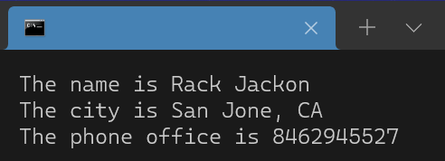

   

Json reader for c++, allows to generate a structure "Json" in c++ from a simple json file.  
build with c++ only, using the fstream and regex libraries.
# Usage
1.	Include JsonReader ``` #include"path/to/JsonReader.h"```
2.	Create a the Json object  ``` Json file("path/to/file.json"); // path to json file ```
3.	Get property like ``` file["path"]["to"]["property"]```  if is array put the number like ``` file["array"][9]["property"]```
    
From the following json file:  
```json
{
    "firstName": "Rack",
    "lastName": "Jackon",
    "gender": "man",
    "age": 24,
    "address": {
        "streetAddress": "126",
        "city": "San Jone",
        "state": "CA",
        "postalCode": "394221"
    },
    "phoneNumbers": [
        { "type": "home", "number": "7383627627" },
        { "type": "office", "number": "8462945527" }
    ]
}
```
The following code must be used:  
```c++
#include<iostream>
using namespace std;

#include"../src/JsonReader.h" // include this file

int main(int argc, char** argv){
    // build a Object Json
	Json file("file.json"); // path to json file
    // Get properties like -> file["path_to_property"]
    cout << "The name is " << file["firstName"] << ' ' << file["lastName"] << endl;
    cout << "The city is " << file["address"]["city"] << ", " << file["address"]["state"] << endl;
    cout << "The phone office is " << file["phoneNumbers"][1]["number"] << endl;
}
```
The result per console is as follows:  
   
